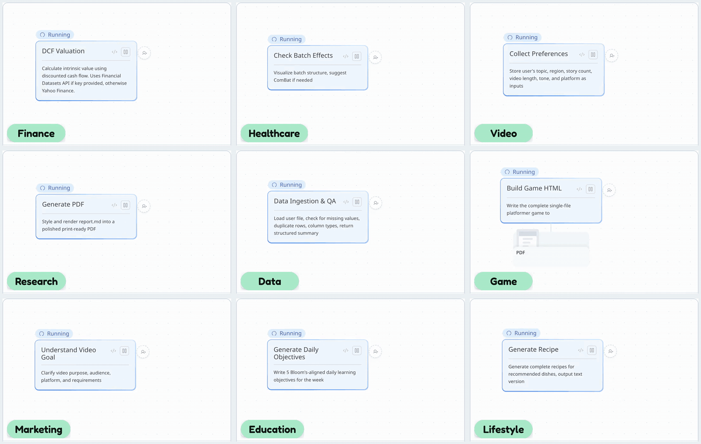
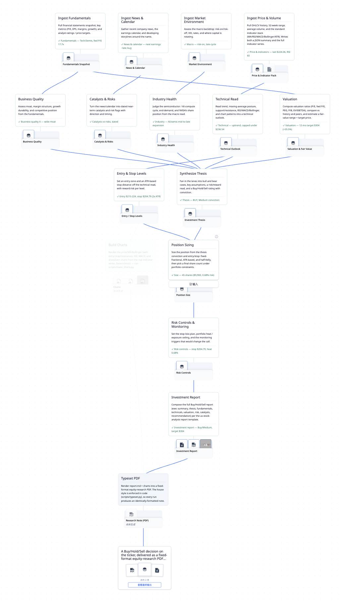
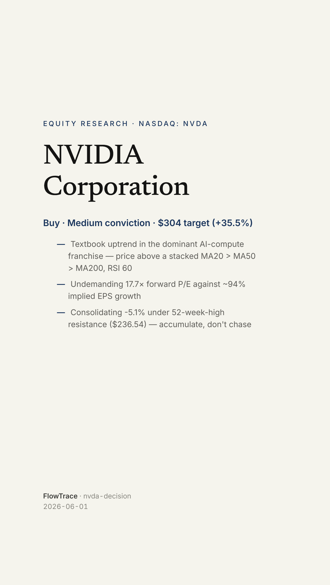

<div align="center">


# Flowtrace

**A transparent, reusable, evolving way to run a task with your agent.**

[](./LICENSE) [](https://morphmind.ai) [](https://discord.gg/x9mtbMEx) [](https://x.com/morphmind__ai?s=11)

[**What it does**](#what-it-does) · [**Install**](#install) · [**Using a trace**](#using-a-trace) · [**Make your own**](#make-your-own-trace) · [**Examples**](docs/EXAMPLES.md) · [**CLI**](docs/trace/CLI.md)

**English** · [简体中文](docs/README.zh-CN.md)

</div>

---

Flowtrace turns a kind of task into a trace your agent works through, step by step. Works with any LLM or agent, including Claude Code, Codex, and Cursor.

<div align="center">

<br><sub>A few of the traces people run — each one a graph you watch build, step by step</sub>
</div>

<div align="center">
<table><tr>
<td align="center" valign="top"><br><sub>The flow</sub></td>
<td align="center" valign="top"><br><sub>The deliverable</sub></td>
</tr></table>
</div>

<p align="center"><a href="docs/assets/examples/nvda-decision.pdf"><strong>Read the full research-note PDF</strong></a></p>

## What it does

**Transparent.** See the work as a graph and open any step's output, so you know how a result was reached, not just what it says.

**Grounded.** Every step writes a real file, and the agent can't cite a result that isn't on disk. The work is there to open and check, not a claim to take on faith.

**Traceable.** Every run is saved as its own version, so you can try another approach without losing the one that worked, and step back through any run to see how it got there.

**Reusable.** The next task of the same kind starts from what you already built, so you run the same steps on new inputs instead of starting from zero.

**Evolving.** Improve a step once and it carries into every run after, so it gets better as you refine it.

## Install

```bash
git clone https://github.com/AIScientists-Dev/flowtrace.git
cd flowtrace
./scripts/install.sh                      # builds + symlinks `flowtrace` to ~/.local/bin/
```

Updating: `git pull && ./scripts/install.sh`. Override the symlink target with `INSTALL_DIR=…`.

Flowtrace also ships a **`make-trace` skill** at `skills/make-trace/`. Copy or symlink it into your coding agent's skills directory (Claude Code, Codex, or Cursor) to author traces with `/make-trace`. See [Make your own](#make-your-own-trace).

To hack on the tool, build it by hand: `cd frontend && npm install && npm run build && cd .. && cargo build --release`. Build the frontend first, since the UI is embedded into the Rust binary at compile time via `rust-embed`.

## Using a trace

A trace is a visual DAG you and your AI both watch while the work runs. To drive one end-to-end:

1. **Serve it.** `flowtrace serve` opens the DAG at `http://localhost:3000`. Git history powers time-travel through every step.

2. **Run it.** In the trace folder, tell your agent _"run this trace."_ It reads `trace.json` and `docs/trace/CLI.md`, then drives the DAG node by node. For each node it issues four commands. Say what it's about to do, do it, mark done with the asset, and post a structured reply to the UI:

   ```bash
   RUN=$(flowtrace run new --name "first pass" | tail -1)

   # For each step, in dependency order:
   flowtrace step <id> running --message "what I'm about to do"
   #   … the agent does the work and writes the step's asset …
   flowtrace step <id> done --asset <file>
   flowtrace reply < reply.json          # structured output for the UI

   # After the last step:
   flowtrace deliverable done --asset <final-output>
   ```

   Every CLI write makes one git commit. Nodes light up in the UI as each step finishes.

You can stop at any node and override the AI's judgment there. Every downstream node that depended on it goes stale and re-runs, so you intervene at one node instead of redoing the whole task.

To run anything you first need a trace in `~/traces/`. There are two ways to get one:

- **[Make your own](#make-your-own-trace):** turn any source material into a new trace.
- **[Try a reference trace](#try-a-reference-trace):** run one of ours for a populated DAG in seconds.

## Make your own trace

The **`make-trace` skill** turns any **source** into a trace: a `SKILL.md`, a runbook, a chat log, a one-line ask, a process you keep in your head, or a task you just finished with your agent. Hand it the source and run `/make-trace`.

Make one when:

- **you'll do this kind of task again.** The run you just did already has the steps and their order, so a trace records that and the next run reuses the shape instead of re-deriving it.
- **it has to come out the same way each time.** The steps and the output format are fixed, so between runs only the input changes.
- **you want to check the middle, not just the answer.** Every step writes a file you can open, and improving one step carries into every run after.

The six steps below lifted the worked example `nvda-decision` from a skill, and they work the same for any source.

This example ships as a builder. Running `bash scripts/examples/nvda-decision/build.sh` regenerates it at `~/traces/nvda-decision/` — a 16-node _"should I buy NVDA?"_ trace in which four ingest lanes fan into a synthesized thesis, sizing and risk controls chain off it, and the report fans in from everything.

The last two nodes are presentation: they render the charts and typeset a **fixed-format research-note PDF**. The format is enforced in code (`scripts/typeset.py`), so every run on any ticker produces an identically-formatted, citable note — only the numbers change.

**0. Have a source.** A `SKILL.md`, a conversation, a runbook, a process in your head: anything that describes _how a kind of task gets done_. The example lifts the [`us-stock-analysis` skill](https://github.com/tradermonty/claude-trading-skills) (by tradermonty), composed with its sibling skills — position sizing, exposure, macro / news / sector, and scenario synthesis — for the lanes that single workflow defers to.

**1. Scaffold an empty trace.**

```bash
cd ~/traces
flowtrace init nvda-decision      # creates nvda-decision/ with .git + an empty trace.json
```

**2. Lift the skill into a DAG.** In the new folder, ask your agent: _"Read `docs/trace/CLI.md` and this source, then lift it into a trace. Fill `trace.json` with the steps and their dependencies."_ This is the core move. The agent pulls the steps hiding in the prose and works out how they connect: which run in parallel, which fan in. The arrows are the knowledge, so get them right.

```bash
flowtrace validate            # check the schema
flowtrace show --fmt mermaid  # eyeball the DAG
```

**3. Verify faithfulness (recommended).** Lifting is judgment, and judgment can flatten a fan-in/fan-out graph into a straight line that's wrong. Have a _second, independent_ agent check the DAG's edges and coverage against the source skill. Does every step appear? Is every dependency real? Was anything dropped? Fix what it finds. (The example took two rounds before an independent review returned "faithful & complete".)

**4. Write a contract per step.** Each step gets a `steps/<id>/STEP.md`: a short Markdown file, with optional YAML frontmatter on top and prose below. The frontmatter `reads`/`writes` show up in the UI; the body says how to do the step. Fold cross-cutting guidance (do's/don'ts, special cases) into the steps they affect.

```markdown
---
name: valuation
description: Valuation ratios vs history/peers, fair-value range, target price.
reads:
  - ingest_fundamentals/fundamentals.json
writes:
  - valuation.json
---

# Valuation

From the fundamentals: compute P/E (trailing / forward), PEG, P/B, EV/EBITDA;
compare to the name's own history and to peers; estimate a fair-value range and
a target price. Write `valuation.json`. Valuation is judgment, not ratio lookup.
```

**5. Run it.** A run's inputs are just files: there's no `inputs` field. Drop them in `resources/` and point the relevant step's `reads:` at them. Then run it as in [Using a trace](#using-a-trace); `flowtrace serve` shows the DAG light up as the agent goes.

That's the whole path: a skill goes in, and a visible, steerable trace — here, one that ends in a fixed-format research-note PDF — comes out. Steps 2 through 5 are the agent's work. You supply the source, the inputs, and your judgment at any node.

## Try a reference trace

Browse them all in the **[examples gallery](docs/EXAMPLES.md)**, each shown as a DAG.

`dream-analysis`, `nested-deps`, `iris-analysis`, `tailored-resume`, and `nvda-decision` each ship as a builder under `scripts/examples/<id>/`. A builder constructs a real trace folder at `~/traces/<id>/`, with its own `.git` and `runs/`, and walks the full CLI lifecycle once to leave a demo run behind.

```bash
bash scripts/examples/iris-analysis/build.sh   # → ~/traces/iris-analysis/
flowtrace serve                                    # → http://localhost:3000
```

One more builder, `spring-demo`, paces the trace-authoring commits so the UI can show the NodeMap entrance and edge-draw animation on a live trace. It only builds the DAG structure, with no CLI run lifecycle:

```bash
bash scripts/examples/spring-demo/build.sh     # → ~/traces/spring-demo/
```

`flowtrace serve` defaults to `--scope ~/traces/`, so it picks up any trace folder under that directory. See [docs/trace/REFERENCE-TRACES.md](./docs/trace/REFERENCE-TRACES.md) for the full set of builders and what each one shows.

## For AI agents using this CLI

Making a _new_ trace from any source? Follow [Make your own trace](#make-your-own-trace) above. This section is for driving a trace that already exists.

If you're an AI assistant working in a trace folder, you only need **two reads** to know the full surface:

1. **`docs/trace/CLI.md`**: the canonical system contract. Concepts, every command, every flag, the reply payload schema, the error catalog. Read it once per session.
2. **`trace.json`** (or `flowtrace show --fmt json`): this trace's plan. Step IDs, dependencies, asset declarations, and the deliverable shape. Read it once per trace.

After those two reads you're ready to issue commands. If you forget a shape mid-task, the binary self-documents:

| You want | Run |
|---|---|
| How do I call this command? | `flowtrace <cmd> --help` |
| What does the reply payload look like? | `flowtrace explain reply` |
| What fields does evidence have? | `flowtrace explain reply.evidence`, then drill: `flowtrace explain reply.evidence.figure` |
| Minimal valid JSON skeleton I can edit | `flowtrace explain reply --output example` |
| Formal JSON Schema (for validators) | `flowtrace explain reply --output jsonschema` |
| What does state.json look like? | `flowtrace explain state` |
| What does trace.json look like? | `flowtrace explain trace` |

All three discovery paths (CLI.md, `--help`, `explain`) come from the same Rust types, so they can't drift.

## Where it fits

An agent stack has three layers, each at its own altitude, and they compose:

- **Skills** are where the *moves* live: a function, an MCP tool, a `SKILL.md` playbook.
- **Workflows** are where *control flow* lives: explicit order, branches, gates.
- **Traces** are where *composition* lives: how those moves string together to do a kind of task, as a graph you can see and steer.

A trace's nodes can call skills, and a trace can be lifted from a skill's prose or written by hand. See [PHILOSOPHY.md](docs/trace/PHILOSOPHY.md) for the rationale.

## How it works

A `trace.json` declares **steps** with DAG dependencies, **assets** produced per step, and a final **deliverable**. Runs live under the trace folder at `runs/<run_id>/`:

```
<trace_root>/
├─ .git/                                    standard git repo, the audit trail
├─ trace.json                              the static plan (DAG + deliverable)
├─ scripts/                                 shared code used by 2+ steps
├─ resources/                               shared static material (refs, papers, master data)
├─ steps/<step_id>/
│  ├─ STEP.md                               per-step contract + impl hints
│  ├─ scripts/                              step-local code
│  └─ resources/                            step-local material (figures, PDFs, fixtures)
└─ runs/<run_id>/
   ├─ state.json                            run status (sole source of truth)
   ├─ replies/NNNN.json                     append-only structured-output stream
   └─ <step_id>/                            run-time files (assets + scratch)
```

The same two-name convention (`scripts/` for code that runs, `resources/` for static material that doesn't) appears at both the trace root and inside each step. Anything reused across 2+ steps belongs at the trace root; single-step material stays inside the step folder. `STEP.md` references either with relative paths.

Every CLI write makes one git commit, scoped to exactly the paths it declares: `state.json` plus any `--asset` paths, or the new reply file plus its cited evidence paths. Scratch files stay untracked. The git history is the audit trail, and the UI can time-travel through it.

**Steps pass data through files, not input parameters.** Each step writes its output as a file (declared in `assets`); a downstream step that needs it just reads that file. See [SCHEMA.md](./docs/trace/SCHEMA.md) and [PHILOSOPHY.md](./docs/trace/PHILOSOPHY.md) for more.

---

## Community

⭐ **If Flowtrace is useful to you, consider starring the repo — it helps others find it.**

- **Contributing**: see [CONTRIBUTING.md](./CONTRIBUTING.md), and look for [good first issues](https://github.com/AIScientists-Dev/Flowtrace/labels/good%20first%20issue).
- **GitHub Issues**: [report bugs / propose changes](https://github.com/AIScientists-Dev/flowtrace/issues)
- **Discord**: [discord.gg/x9mtbMEx](https://discord.gg/x9mtbMEx)
- **X**: [@morphmind__ai](https://x.com/morphmind__ai?s=11)

---

MIT. See [`LICENSE`](./LICENSE).
