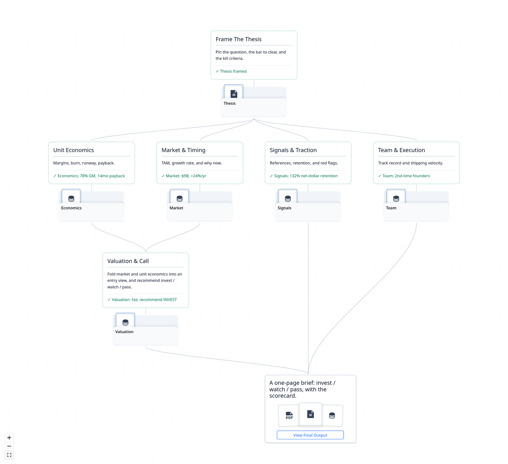
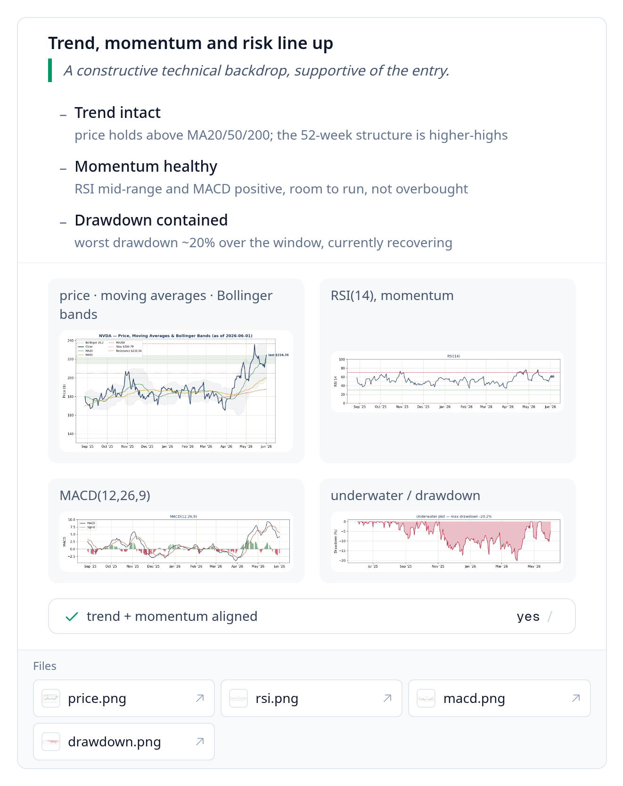
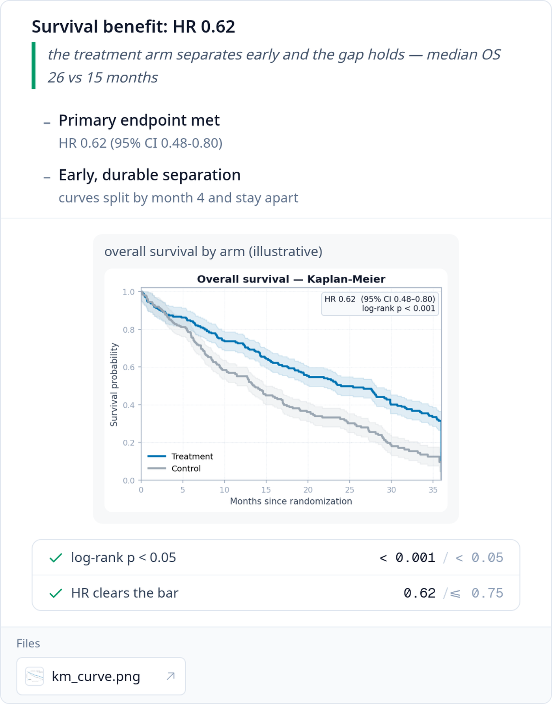
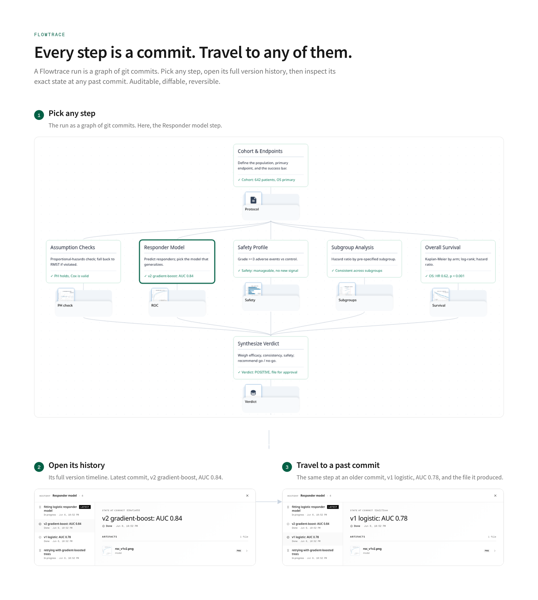
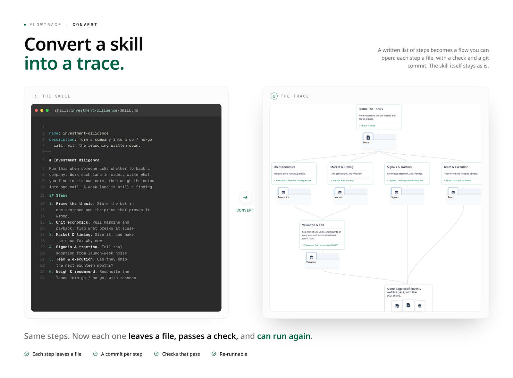
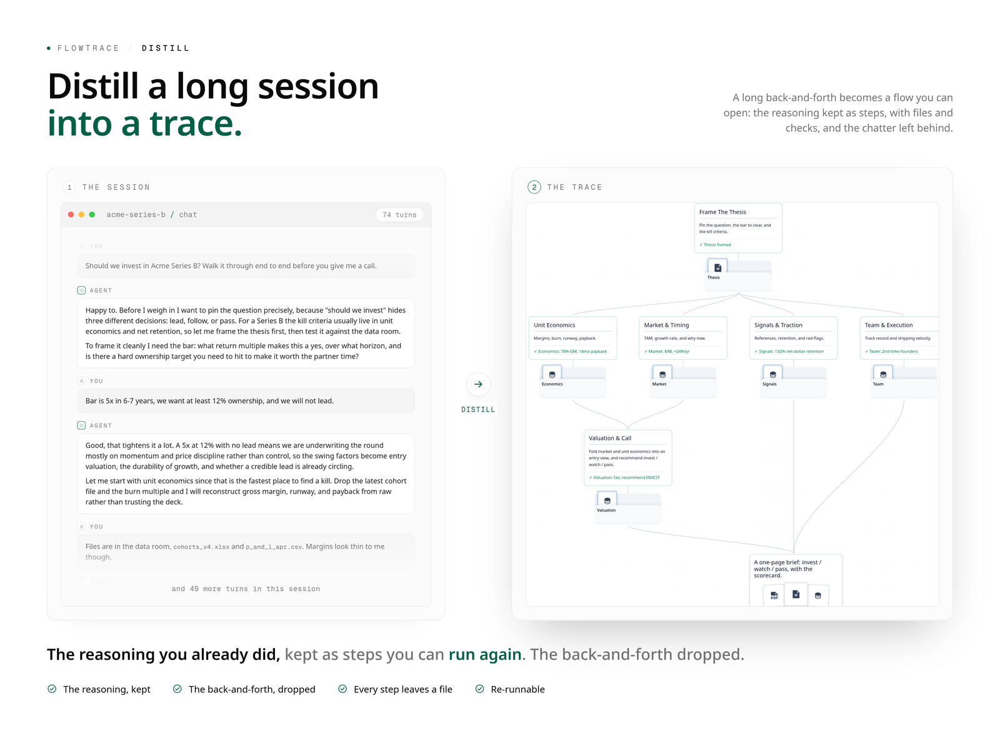
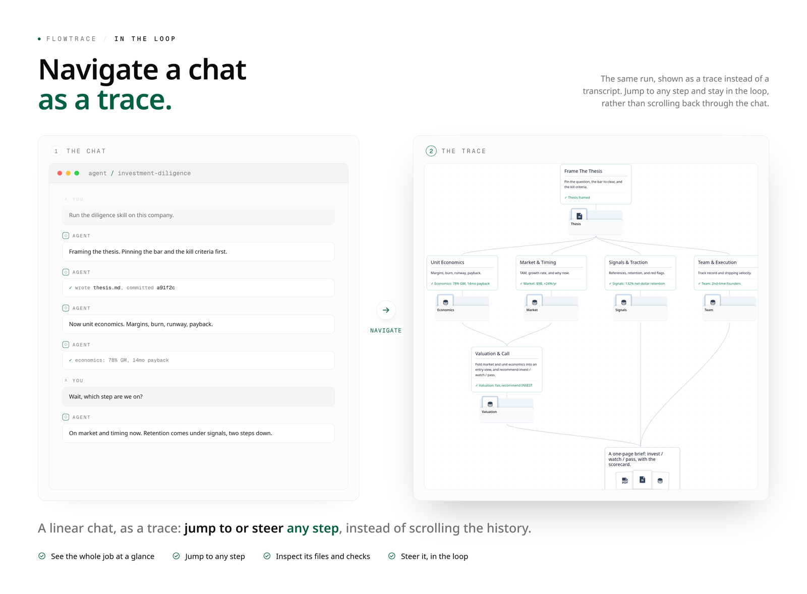
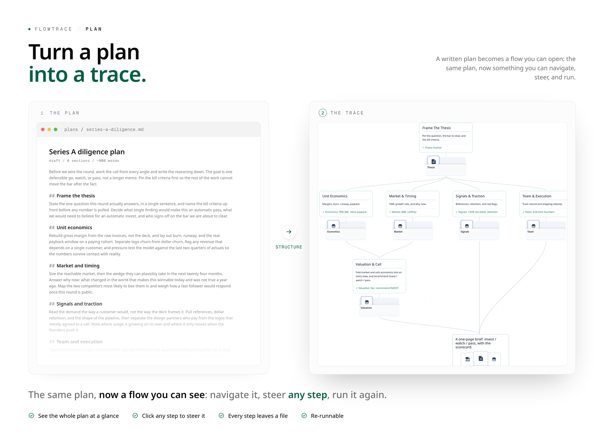
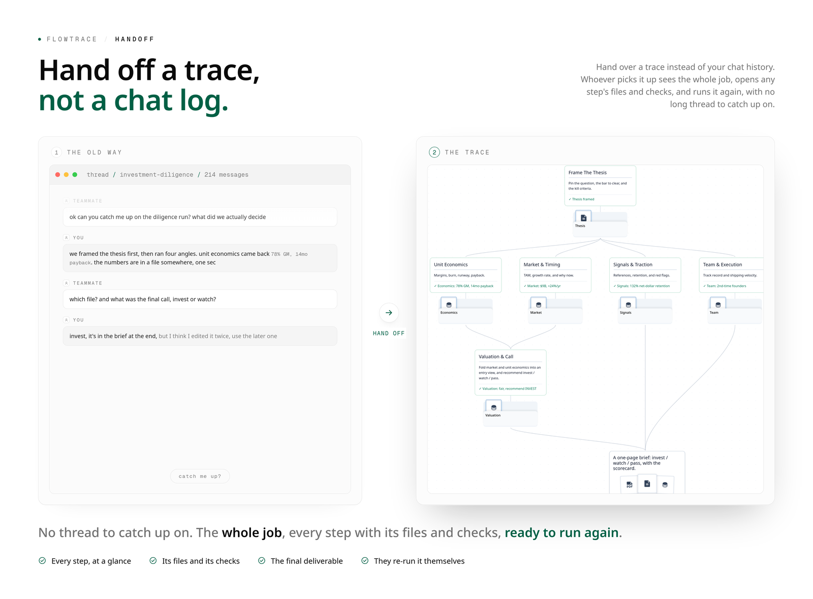

<div align="center">


# Flowtrace

**Run your agent's work as steps you can follow, check, and reuse, instead of a stream of text that buries you and then disappears.**

Works with the agent you already use: Claude Code, Codex, Cursor.

[](./LICENSE) [](https://morphmind.ai) [](https://discord.gg/x9mtbMEx) [](https://x.com/morphmind__ai?s=11)

[**What it does**](#what-it-does) · [**Get started**](#get-started) · [**Examples**](#examples) · [**Docs**](docs/trace/README.md)

**English** · [简体中文](docs/README.zh-CN.md)

</div>

---

Real work with an agent happens as a stream of text. You run a skill and it does the whole task in one pass, or you go back and forth in a chat that keeps growing. Either way it piles up faster than you can follow, and once it is done you are left with a wall of messages.

For a quick question that is fine. For a buy or sell call, a due diligence memo, a security gate, anything you would actually need to verify or run again, it is a problem:

- It is too much to follow. The thread grows longer than you can hold, and you lose track of what was decided and why.
- You cannot check it. A confident wrong answer looks exactly like a right one.
- You cannot steer it. One bad assumption in the middle means redoing the whole thing and hoping the good parts survive.
- It does not last. Every session is a cold start, and the good ones evaporate into scrollback.

Flowtrace runs that same work as a trace: a flow of steps the agent moves through one at a time, each leaving its output on disk. Here is one, a buy or sell decision that ends in a fixed-format, citable PDF:

<div align="center">
<table><tr>
<td align="center" valign="top"><a href="docs/assets/examples/nvda-decision.png"></a><br><sub>The flow · click to enlarge</sub></td>
<td align="center" valign="top"><a href="docs/assets/examples/nvda-decision.pdf"></a><br><sub>The deliverable · click to open</sub></td>
</tr></table>
</div>

<p align="center"><a href="docs/assets/examples/nvda-decision.pdf"><strong>Read the full research-note PDF</strong></a></p>

## What it does

Same skills, same agent. Running that work as a trace is what changes:

**Transparent.** The work is a flow of steps you take in at a glance, not a thread you scroll. Each step's output is a file you open, so the intermediate work is right there instead of buried in messages.

<div align="center">

<br><sub>Each step runs in turn and writes its output to a file.</sub>
</div>

**Grounded.** Every result points back to the files it came from, so you verify instead of trust.

<div align="center">
<table><tr>
<td align="center" valign="top"><a href="docs/assets/cap/grounded-finance.png"></a><br><sub>Finance</sub></td>
<td align="center" valign="top"><a href="docs/assets/cap/grounded-clinical.png"></a><br><sub>Clinical</sub></td>
</tr></table>
<sub>Two high-stakes decisions, same shape: the finding, its charts, the checks that pass, and the files they came from.</sub>
</div>

**Steerable.** Fix one step and only what depends on it re-runs. The rest stays put.

**Traceable.** The whole run is files and git, so it does not vanish when you close the tab. Stop and resume anytime, hand it to a teammate, read the full history.

<div align="center">

<br><sub>Pick any step, open its history, travel to any past commit.</sub>
</div>

**Reusable.** A finished task becomes a trace you run again on new input. The method is reused, not rebuilt.

**Evolving.** The trace gets better the more it runs. When a step misses its bar, the next version switches to a method that clears it, and the version that passes is the one that sticks.

You do not start from scratch. A skill, a long session, a chat, a plan, a finished run you hand off: run any of them as a trace and you get the same steps you can follow, check, and run again. Open any one to read it full size.

<div align="center">
<table>
<tr>
<td align="center" valign="top"><a href="docs/assets/onramp/convert.png"></a></td>
<td align="center" valign="top"><a href="docs/assets/onramp/distill.png"></a></td>
</tr>
<tr>
<td align="center" valign="top"><a href="docs/assets/onramp/in-loop.png"></a></td>
<td align="center" valign="top"><a href="docs/assets/onramp/plan.png"></a></td>
</tr>
<tr>
<td align="center" valign="top" colspan="2"><a href="docs/assets/onramp/handoff.png"></a></td>
</tr>
</table>
</div>

Not every task needs this. A quick one off, just chat. Flowtrace earns its place when the result matters enough to verify, or when you will run the task again.

## Get started

The fast path is to hand the repo to an agent. Point a coding agent (Claude Code, Codex, Cursor) at this folder and say:

> _"Install Flowtrace and run the tailored-resume example."_

It installs the CLI, builds a real trace at `~/traces/tailored-resume/`, and opens the web view at `http://localhost:3000`, where the flow lights up step by step.

Two ways to get a trace:

- **Try a reference.** Each example ships as a builder that creates a real trace folder and walks one full run.

  ```bash
  bash scripts/examples/tailored-resume/build.sh   # → ~/traces/tailored-resume/
  flowtrace serve                                  # → http://localhost:3000
  ```

- **Make your own.** The `make-trace` skill turns any source (a `SKILL.md`, a runbook, a chat log, a finished task) into a trace. Copy `skills/make-trace/` into the agent's skills directory and run `/make-trace`.

A run is steerable: stop at any step, change it, and the steps that depend on it re-run while the rest stay put.

<details>
<summary>Install by hand</summary>

```bash
git clone https://github.com/AIScientists-Dev/flowtrace.git
cd flowtrace
./scripts/install.sh        # builds + symlinks flowtrace to ~/.local/bin/
```

Update with `git pull && ./scripts/install.sh`. Override the symlink target with `INSTALL_DIR=…`. Building from source or contributing? See [CONTRIBUTING.md](./CONTRIBUTING.md).

</details>

## Examples

**Nine examples** built from popular open-source skills, spanning different domains. Open any one for its flow and a one-command demo in the [examples gallery](docs/EXAMPLES.md):

<div align="center">
<table><tr>
<td align="center" valign="top"><a href="docs/EXAMPLES.md#saas-dd"></a><br><sub><a href="docs/EXAMPLES.md#saas-dd">SaaS due diligence</a></sub></td>
<td align="center" valign="top"><a href="docs/EXAMPLES.md#security-cicd"></a><br><sub><a href="docs/EXAMPLES.md#security-cicd">Security CI/CD gate</a></sub></td>
<td align="center" valign="top"><a href="docs/EXAMPLES.md#distill-mind"></a><br><sub><a href="docs/EXAMPLES.md#distill-mind">Distill a mind into a skill</a></sub></td>
</tr></table>
</div>

Plus six more:

- Career: [Tailored Résumé Generator](docs/EXAMPLES.md#tailored-resume)
- Investing: [Comprehensive Stock Analysis](docs/EXAMPLES.md#nvda-decision)
- Research / writing: [Industry Deep-Dive Report](docs/EXAMPLES.md#research-writer)
- Software engineering: [Bug-Fix Learning Loop](docs/EXAMPLES.md#swe-bugfix)
- Growth / marketing: [Weekly Paid-Ads Optimization](docs/EXAMPLES.md#paid-ads)
- Design / decks: [Talk → Magazine Slide Deck](docs/EXAMPLES.md#talk-to-deck)

## Documentation

A trace is one git repository. `trace.json` declares the steps, their dependencies, and the final deliverable. Each run lives under `runs/<run_id>/`:

```
<trace_root>/
├─ .git/                                    standard git repo, the audit trail
├─ trace.json                              the static plan (steps + deliverable)
├─ scripts/                                 shared code used by 2+ steps
├─ resources/                               shared static material (refs, papers, master data)
├─ steps/<step_id>/
│  ├─ STEP.md                               per-step contract + impl hints
│  ├─ scripts/                              step-local code
│  └─ resources/                            step-local material (figures, PDFs, fixtures)
└─ runs/<run_id>/
   ├─ state.json                            run status (sole source of truth)
   ├─ replies/NNNN.json                     append-only structured-output stream
   └─ <step_id>/                            run-time files (assets + scratch)
```

The same two-name convention (`scripts/` for code that runs, `resources/` for static material that doesn't) appears at both the trace root and inside each step. Anything reused across 2+ steps belongs at the trace root; single-step material stays inside the step folder. `STEP.md` references either with relative paths.

Every CLI write makes one git commit, scoped to exactly the paths it declares: `state.json` plus any `--asset` paths, or the new reply file plus its cited evidence paths. Scratch files stay untracked. The git history is the audit trail, and the UI can time-travel through it.

Steps pass data through files, not parameters: each step writes its output, and a downstream step reads it.

| To learn | Read |
|---|---|
| The idea, in depth | [PHILOSOPHY.md](docs/trace/PHILOSOPHY.md) |
| Driving a trace as an agent | [docs/trace/CLI.md](docs/trace/CLI.md) |
| Making a trace | [skills/make-trace/SKILL.md](skills/make-trace/SKILL.md), or run `/make-trace` |
| The format spec | [SCHEMA.md](docs/trace/SCHEMA.md) and [FIELDS.md](docs/trace/FIELDS.md) |
| All examples | [docs/EXAMPLES.md](docs/EXAMPLES.md) |

---

## Community

**If Flowtrace is useful to you, consider starring the repo. It helps others find it.**

- **Contributing**: see [CONTRIBUTING.md](./CONTRIBUTING.md), and look for [good first issues](https://github.com/AIScientists-Dev/Flowtrace/labels/good%20first%20issue).
- **GitHub Issues**: [report bugs / propose changes](https://github.com/AIScientists-Dev/flowtrace/issues)
- **Discord**: [discord.gg/x9mtbMEx](https://discord.gg/x9mtbMEx)
- **X**: [@morphmind__ai](https://x.com/morphmind__ai?s=11)

---

MIT. See [`LICENSE`](./LICENSE).
