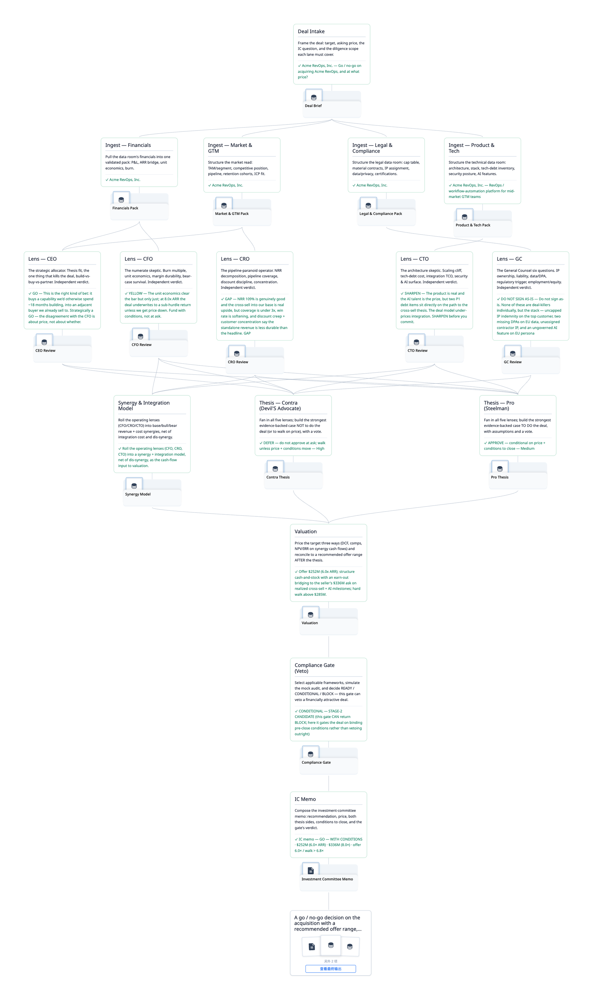
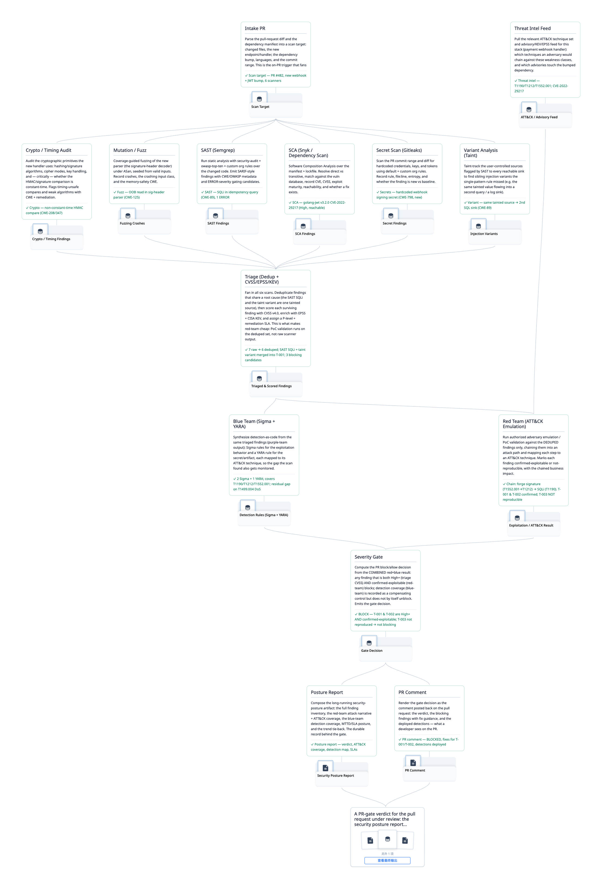
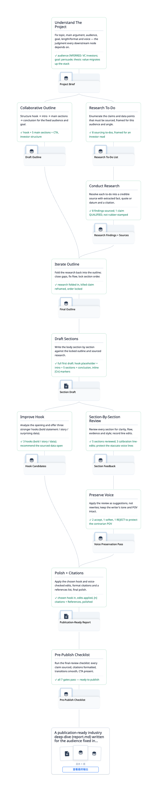
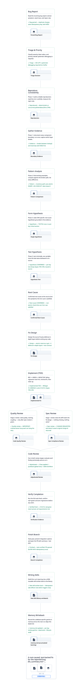
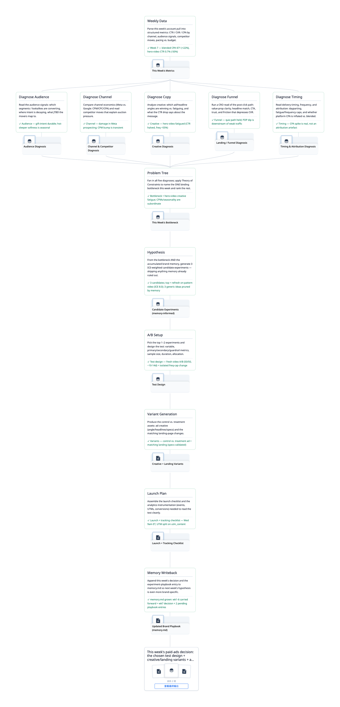
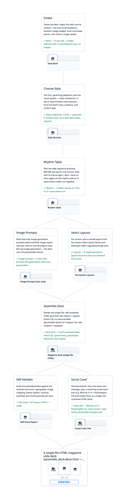

# 示例

[English](EXAMPLES.md) · **简体中文**

一组示例 trace 的画廊 —— 每个都基于一个流行的开源 agent skill 构建。按领域挑一个：

| 领域 | 示例 |
|---|---|
| 📄 求职 | 简历定向优化 |
| 💰 投资 | 个股综合分析 |
| 🤝 企业并购 / M&A | SaaS 收购尽职调查 |
| 🛡 安全 / DevSecOps | 安全 CI/CD 流水线 |
| ✍️ 研究 / 写作 | 行业深度报告 |
| 🐛 软件工程 | Bug 修复学习循环 |
| 📈 增长 / 营销 | 每周付费广告优化 |
| 🧠 知识 / 人物 | 把一个人的思维蒸馏成 Skill |
| 🖼 设计 / 演示 | 演讲 → 杂志风幻灯片 |

**跑一个** —— ▶ *live*（真实用法）：对你的 agent 说一句 _"run this trace"_，喂你自己的输入，它会逐节点
真正干活。▷ *demo*：`bash scripts/examples/<id>/build.sh` 回放一段预录的、仅作示意的运行；`flowtrace serve`
打开 UI。纯 CLI 界面 / 动画类的合成 demo 见 [REFERENCE-TRACES.md](trace/REFERENCE-TRACES.md)。

---

## 📄 求职 — 简历定向优化

把简历对准某个职位精修 —— 并行解析职位描述与简历，给每条 bullet 打分，改写偏弱的，做 ATS 安全的排版。每一处判断都是一个你能指着、能推翻的节点。*Demo：虚构候选人。*

**来源** [ComposioHQ/awesome-claude-skills](https://github.com/ComposioHQ/awesome-claude-skills) · **Demo** `bash scripts/examples/tailored-resume/build.sh`

---

## 💰 投资 — 个股综合分析

一次完整的单只股票分析 —— 四条数据线（价格、基本面、宏观、新闻）→ 五项分析 → 综合出买入 / 持有 / 卖出的论点 → 仓位测算。改一个假设，整条链重新评估。*Demo：NVDA。*

**来源** [tradermonty/claude-trading-skills](https://github.com/tradermonty/claude-trading-skills) · **Demo** `bash scripts/examples/nvda-decision/build.sh`

---

## 🤝 企业并购 / M&A — SaaS 收购尽职调查

把收购尽调画成一张 DAG —— 四路数据摄入 → 五个 C-suite 视角并行（若串行跑，第一个视角的框架会污染其余）→ 一份两面论点 → 估值 → 最后但有否决权的合规一票。*Demo：虚构公司，示意数字。*

**来源** [alirezarezvani/claude-skills](https://github.com/alirezarezvani/claude-skills) · **Demo** `bash scripts/examples/saas-dd/build.sh`

---

## 🛡 安全 / DevSecOps — 安全 CI/CD 流水线

一道 PR 安全闸 —— 六路并行扫描 → 归并定级 → 红队（ATT&CK）∥ 蓝队（Sigma/YARA）→ 只在「高危且确认可利用」的发现上才拦截的闸门。红队跑在定级*之后*而非之前：对未去重的发现做验证，会把算力耗在误报上。

**来源** [mukul975/Anthropic-Cybersecurity-Skills](https://github.com/mukul975/Anthropic-Cybersecurity-Skills) · **Demo** `bash scripts/examples/security-cicd/build.sh`

---

## ✍️ 研究 / 写作 — 行业深度报告

写一篇长篇行业报告 —— 第一个节点定下读者、目标、角度，后面十个节点都依赖它。改这一个判断（比如 VC 投资人 → 企业创始人），提纲、初稿、各章节顺着往下重写。

**来源** [ComposioHQ/awesome-claude-skills](https://github.com/ComposioHQ/awesome-claude-skills)（`content-research-writer`） · **Demo** `bash scripts/examples/research-writer/build.sh`

---

## 🐛 软件工程 — Bug 修复学习循环

一条 bug 修复循环 —— systematic-debugging 的四个阶段 → 一次 TDD 修复 → 两段式 review。每跑一次，它都把发现的、该代码库特有的坑写回去，并打磨自己的 STEP.md，于是到第五次跑时这条 trace 已经懂你的代码 —— 差异在 git log 里看得见。

**来源** [obra/superpowers](https://github.com/obra/superpowers) · **Demo** `bash scripts/examples/swe-bugfix/build.sh`

---

## 📈 增长 / 营销 — 每周付费广告优化

一条每周付费广告循环 —— 每周的数据扇出成五项诊断 → 一棵问题树 → 从累积的 `memory.md` 里抽取测试候选。假设节点起初是通用的，跑到第二十周，它会写下从真实实验里挣来的、品牌专属的启发式规则 —— 这条 trace 变成了你的打法手册。

**来源** [coreyhaines31/marketingskills](https://github.com/coreyhaines31/marketingskills) · **Demo** `bash scripts/examples/paid-ads/build.sh`

---

## 🧠 知识 / 人物 — 把一个人的思维蒸馏成 Skill

把一个人的思维蒸馏成一个可复用的 skill —— 六条并行研究线，但只有通过三重检验（跨领域 ∧ 可预测 ∧ 独特）的特质才进入综合。每条线都引用一个文件，所以这个 persona 不能声称一个不在磁盘上的特质。*Demo：虚构人物。*

**来源** [alchaincyf/nuwa-skill](https://github.com/alchaincyf/nuwa-skill)（花叔 / 女娲） · **Demo** `bash scripts/examples/distill-mind/build.sh`

---

## 🖼 设计 / 演示 — 演讲 → 杂志风幻灯片

把原始内容变成一份单文件 HTML 杂志风幻灯 —— 选一套视觉系统，搭出节奏表，在图像 prompt 并行生成的同时挑版式，组装，自检。给一场想要编辑风的演讲选了 Swiss 风？改 `choose_style`，整份幻灯重新渲染。

**来源** [op7418/guizang-ppt-skill](https://github.com/op7418/guizang-ppt-skill)（歸藏） · **Demo** `bash scripts/examples/talk-to-deck/build.sh`

---

## 来源致谢

这些 trace 基于以下开源 skill 构建：

| 示例 | 来源 | 许可证 |
|---|---|---|
| 简历定向优化 | [ComposioHQ/awesome-claude-skills](https://github.com/ComposioHQ/awesome-claude-skills) | Apache 2.0 |
| 个股综合分析 | [tradermonty/claude-trading-skills](https://github.com/tradermonty/claude-trading-skills) | MIT |
| SaaS 收购尽职调查 | [alirezarezvani/claude-skills](https://github.com/alirezarezvani/claude-skills) | MIT |
| 安全 CI/CD 流水线 | [mukul975/Anthropic-Cybersecurity-Skills](https://github.com/mukul975/Anthropic-Cybersecurity-Skills) | Apache 2.0 |
| 行业深度报告 | [ComposioHQ/awesome-claude-skills](https://github.com/ComposioHQ/awesome-claude-skills)（`content-research-writer`） | Apache 2.0 |
| Bug 修复学习循环 | [obra/superpowers](https://github.com/obra/superpowers) | MIT |
| 每周付费广告优化 | [coreyhaines31/marketingskills](https://github.com/coreyhaines31/marketingskills) | MIT |
| 把一个人的思维蒸馏成 Skill | [alchaincyf/nuwa-skill](https://github.com/alchaincyf/nuwa-skill)（花叔 / 女娲） | MIT |
| 演讲 → 杂志风幻灯片 | [op7418/guizang-ppt-skill](https://github.com/op7418/guizang-ppt-skill)（歸藏） | AGPL-3.0 ¹ |

¹ `talk-to-deck` 基于一个 AGPL-3.0 来源 —— 仅借鉴工作流（我们自己的渲染器，未拷贝任何源文件）。

---

## 怎么写你自己的

上面每个示例都是一个你能从头读到尾的真实 builder：`scripts/examples/<id>/template/` 里放着 `trace.json`
（那张 DAG）、各步的 `STEP.md` 契约，以及共享的 `scripts/` —— 跟你手写时的结构一模一样。让每个示例成立的
关键动作是：读一个源 skill 的散文，把藏在里面的步骤抽出来，理清它们怎么连 —— 哪些并行、
哪些汇入。箭头就是知识所在，所以一定要连对。

想把你自己的素材变成一条 trace（一份 `SKILL.md`、一份操作手册、一段对话、一件做完的任务），用
[`make-trace`](../skills/make-trace/SKILL.md) skill：把 `skills/make-trace/` 复制到 agent 的 skills 目录，运行
`/make-trace`。trace.json 的 schema 见 [SCHEMA.md](trace/SCHEMA.md)；面向 agent 的 CLI 参考见 [CLI.md](trace/CLI.md)。
