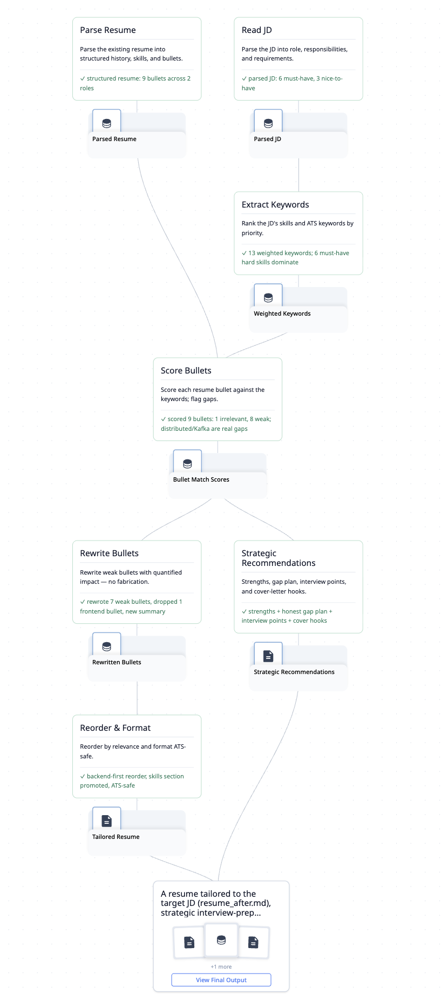
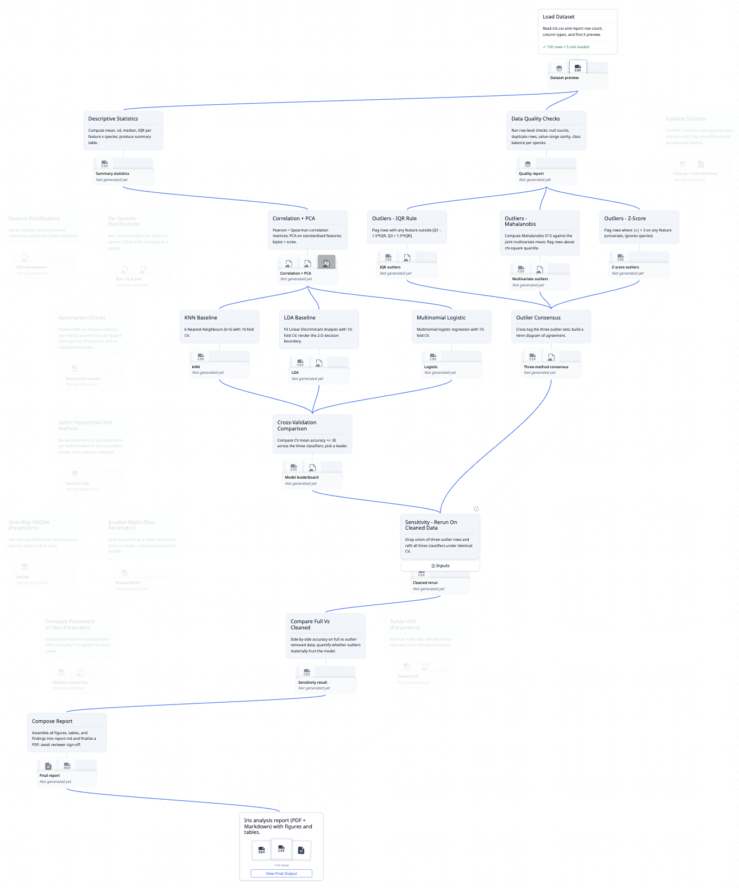
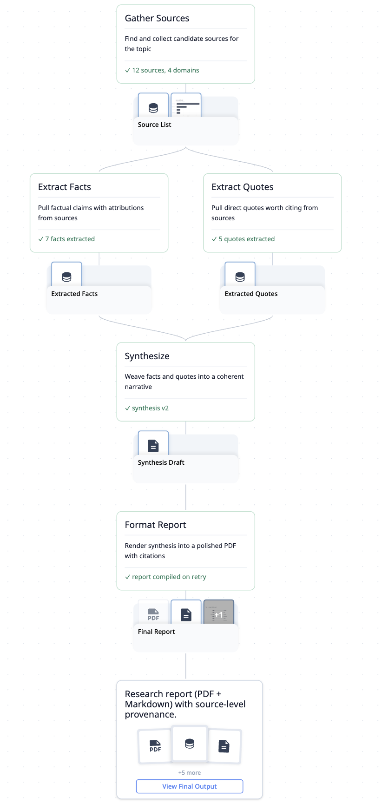
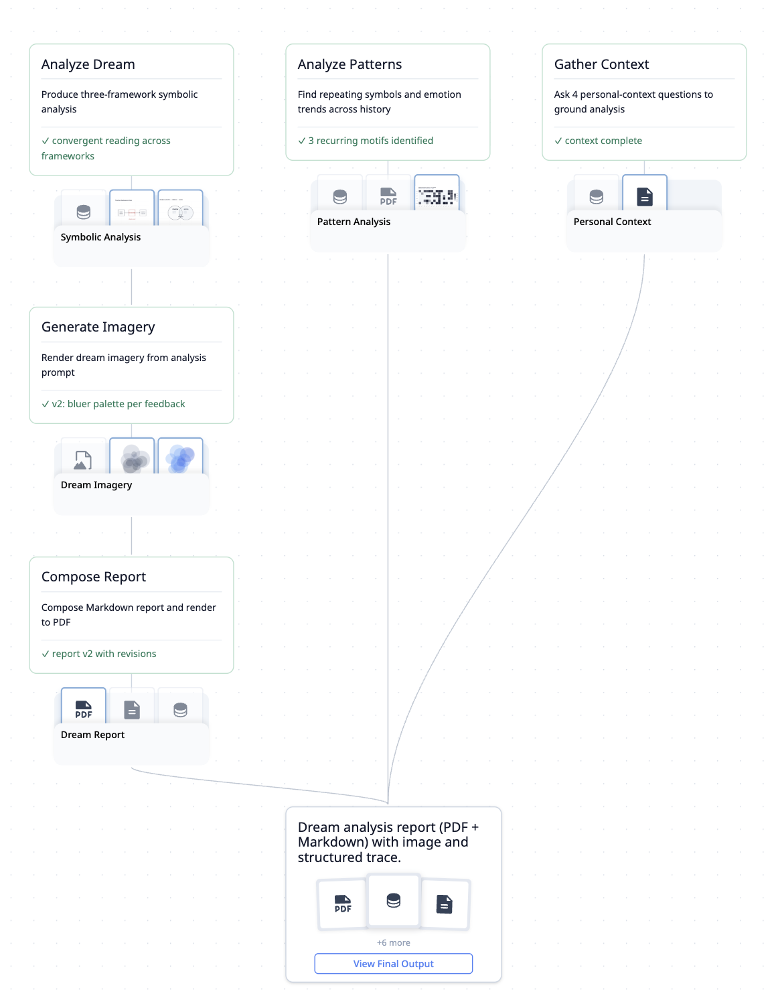

# 示例

下面每个示例都是一个真实的 trace，一条命令即可生成，然后在网页 UI 里打开。跑一次 builder，再运行：

```bash
flowtrace serve        # → http://localhost:3000
```

完整的技术参考（每个 builder，包括最小的 CLI 演示）见 [REFERENCE-TRACES.md](trace/REFERENCE-TRACES.md)。

[English](EXAMPLES.md) · **简体中文**

---

## Tailored Resume Generator

把简历裁剪到对准某个具体职位。一份 `SKILL.md` 提炼成的 7 节点 fan-in/fan-out DAG：并行解析 JD 与简历，逐条 bullet 对关键词打分，改写偏弱的，做 ATS 安全的排版，再单分出一支战略面试建议。README [做你自己的 trace](README.zh-CN.md#做你自己的-trace) 一节详细走的就是这个例子。



```bash
bash scripts/examples/tailored-resume/build.sh
```

---

## Deep Iris Analysis

一条 24 步的统计分析流水线：描述统计、分布诊断、三种离群检测、取共识、按条件走参数/非参数推断、分类，最后汇成报告。最深的一个例子，带假设检验关卡和一次出错重试。



```bash
bash scripts/examples/iris-analysis/build.sh
```

---

## Research Synthesis

给定一个主题，收集来源，并行抽取事实与引文，编织成叙述，再排版成带引用的报告。一张干净的菱形 DAG。



```bash
bash scripts/examples/nested-deps/build.sh
```

---

## Dream Analysis

拿一个梦，收集个人背景，做三套符号框架（荣格、弗洛伊德、东方）的分析，生成一张配图，并汇成一份 PDF 报告。



```bash
bash scripts/examples/dream-analysis/build.sh
```
