<div align="center">


# Flowtrace

**把 agent 的工作跑成一串你能看懂、能核验、能复用的 step，而不是一段把你淹没、转头就消失的文字。**

兼容你已经在用的 agent：Claude Code、Codex、Cursor。

[](https://github.com/AIScientists-Dev/flowtrace/stargazers) [](../LICENSE) [](https://morphmind.ai) [](https://discord.gg/x9mtbMEx) [](https://x.com/morphmind__ai?s=11)

[**它能做什么**](#它能做什么) · [**快速开始**](#快速开始) · [**示例**](#示例) · [**文档**](trace/README.md)

[English](README.en.md) · **简体中文**

⭐ **觉得 Flowtrace 有用，就给个 star** *(按钮在右上角)* —— 这是我们判断要不要继续公开打磨它的依据。

</div>

---

与 agent 的实际工作，呈现为一段文字流。你运行一个 skill，它一次性完成整个任务；或在一段不断变长的 chat 中反复往返。无论哪种，信息累积的速度都快于你能跟进的速度；任务结束时，留给你的是一整面墙的消息。

对于一次随手的提问，这样没问题。但对于一个买入或卖出的判断、一份尽职调查备忘、一道安全门禁，以及任何你真正需要核验、或需要重复运行的工作，这就成了问题：

- **信息过载。** 对话不断变长，超出你能掌握的范围，当初做了哪些决策、依据为何，逐渐无从追溯。
- **无法核验。** 一个自信的错误结论，与正确结论在外观上无从区分。
- **无法干预。** 中途一处前提有误，往往意味着整体重做，且只能寄望其中有效的部分得以保留。
- **难以留存。** 每次 session 都是冷启动，有价值的成果消散在历史记录之中。

Flowtrace 把同样的工作跑成一条 trace：一串 step 组成的流程，agent 一次只走一步，每一步都把产出写进一个文件。下面就是这样一条 trace，一个买入或卖出的判断，最终落成一份格式固定、可引用的 PDF：

<div align="center">
<table><tr>
<td align="center" valign="top"><a href="assets/examples/nvda-decision.png">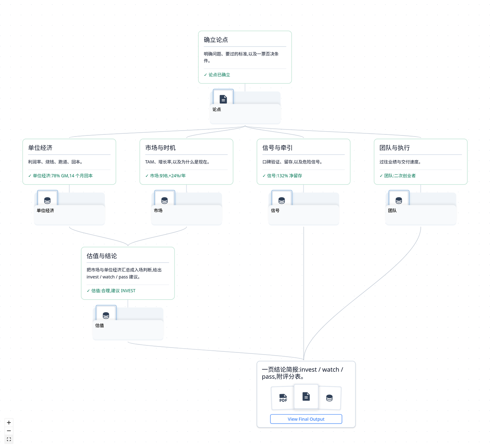</a><br><sub>流程 · 点击放大</sub></td>
<td align="center" valign="top"><a href="assets/examples/nvda-decision.pdf">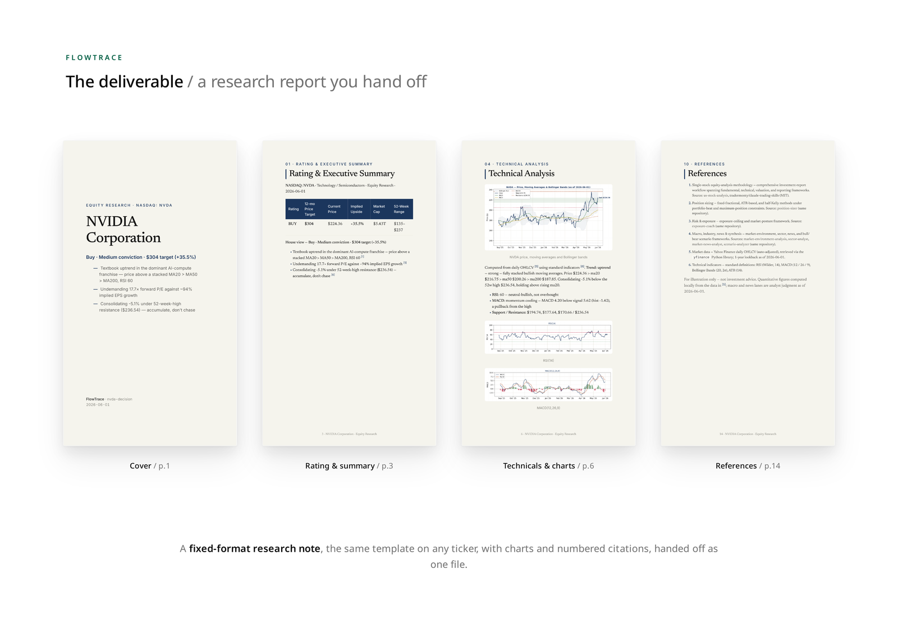</a><br><sub>交付物 · 点击打开</sub></td>
</tr></table>
</div>

<p align="center"><a href="assets/examples/nvda-decision.pdf"><strong>阅读完整研究报告 PDF</strong></a></p>

## 它能做什么

同样的 skill，同样的 agent。变的是：把这份工作跑成一条 trace。

**透明（Transparent）。** 工作是一串一眼就能看清的 step，而不是一段需要滚动的线程。每一步的产出都是一个能打开的文件，中间过程就摆在那里，而不是埋在消息里。

<div align="center">

<br><sub>每一步依次运行，并把产出写进一个文件。</sub>
</div>

**有据可查（Grounded）。** 每个结论都能指回它来自的文件，所以你是核验，而不是盲信。

<div align="center">
<table><tr>
<td align="center" valign="top"><a href="assets/zh/cap/grounded-finance.png">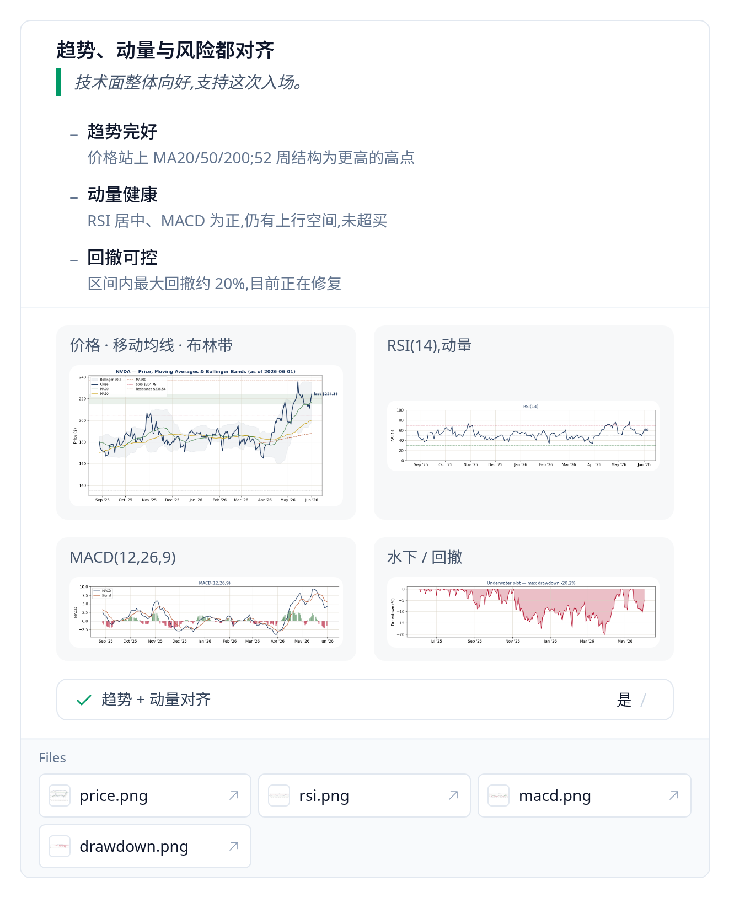</a><br><sub>金融</sub></td>
<td align="center" valign="top"><a href="assets/zh/cap/grounded-clinical.png">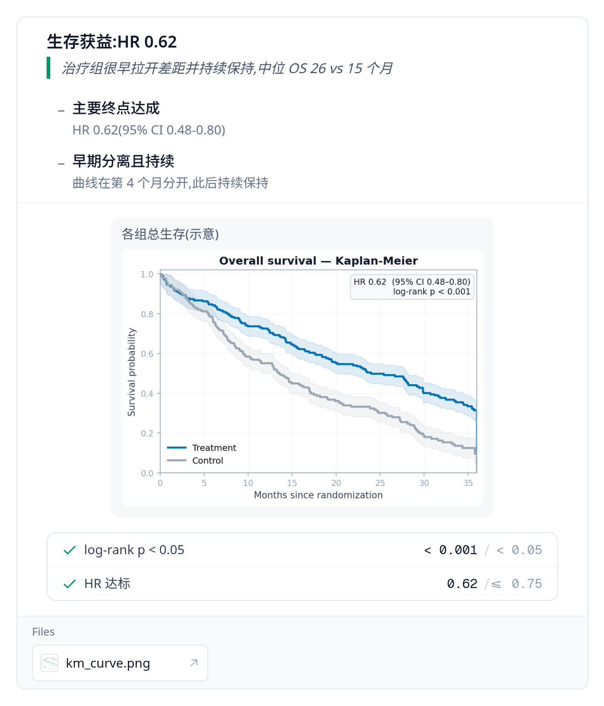</a><br><sub>临床</sub></td>
</tr></table>
<sub>两个高风险决策，形状相同：结论、它的图表、通过的检查，以及它们来自的文件。</sub>
</div>

**可介入（Steerable）。** 改其中一步，只有依赖它的部分会重跑，其余的原地不动。

**可追溯（Traceable）。** 整次 run 都是文件加 git，关掉标签页也不会消失。随时停下、随时继续，交给同事，翻看完整历史。

<div align="center">
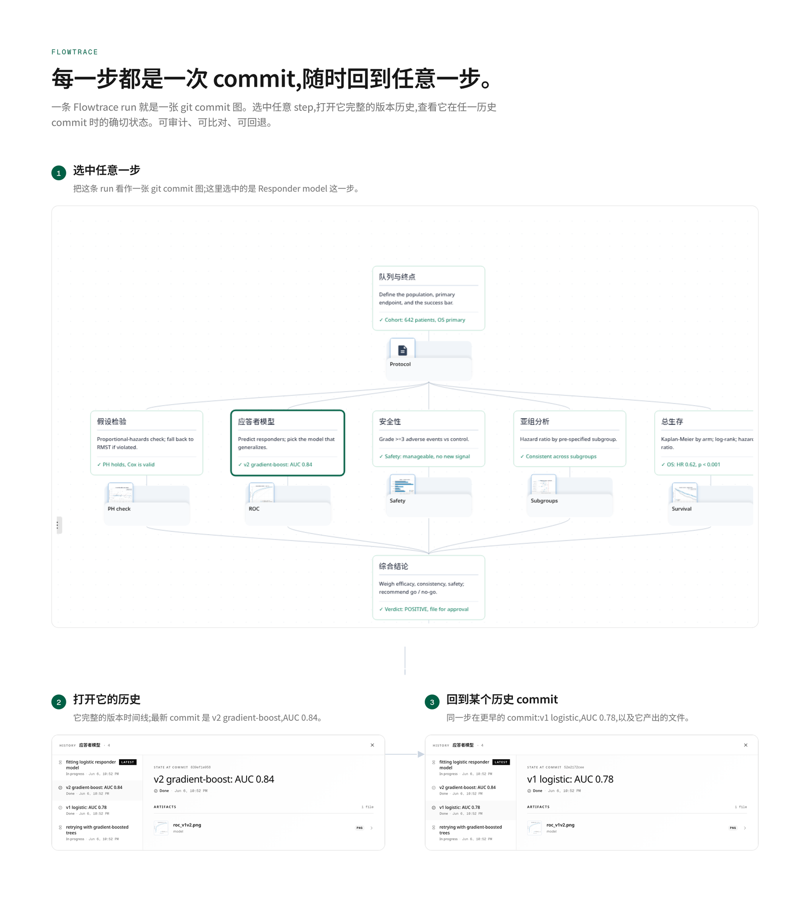
<br><sub>选中任意一步，打开它的历史，回到任意一个历史 commit。</sub>
</div>

**可复用（Reusable）。** 一件做完的任务，变成一条你能在新输入上再跑一遍的 trace。方法是被复用，而不是被重建。

**会进化（Evolving）。** trace 运行得越多，就越完善。当某一步未达到其标准，下一个版本会改用一种能达标的方法，而通过的那个版本会被保留下来。

**结构化阅读。** 一条 trace 把工作呈现为一张由文件组成的图，而不是一条线性记录。agent 按结构、按需来读：只在处理某一步时载入它的契约、输入与输出，并沿显式声明的依赖前进，而不是把整段历史一直带在上下文里。这把工作上下文限定在小范围、降低跑偏，得到的表示也能被人与 agent 共同审查、扩展。

你不必从零开始。一个 skill、一段很长的 session、一份 plan、一次做完的 run：把它们中的任何一个作为 trace 来运行，你都会得到同样一串可跟进、可核验、可重复运行的 step。点开任意一张可看大图。

<div align="center">
<table>
<tr>
<td align="center" valign="top"><a href="assets/zh/onramp/convert.png">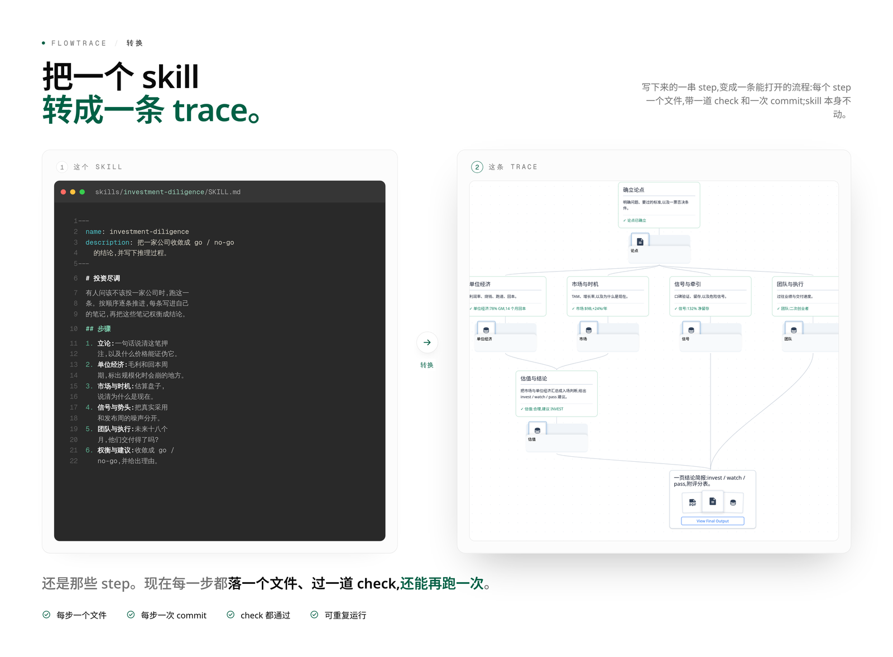</a></td>
<td align="center" valign="top"><a href="assets/zh/onramp/distill.png">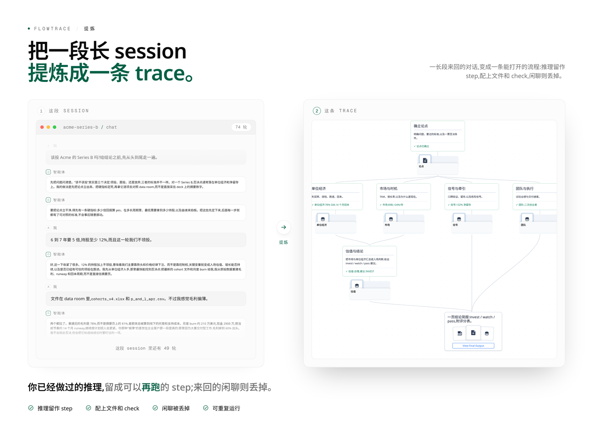</a></td>
</tr>
<tr>
<td align="center" valign="top"><a href="assets/zh/onramp/plan.png">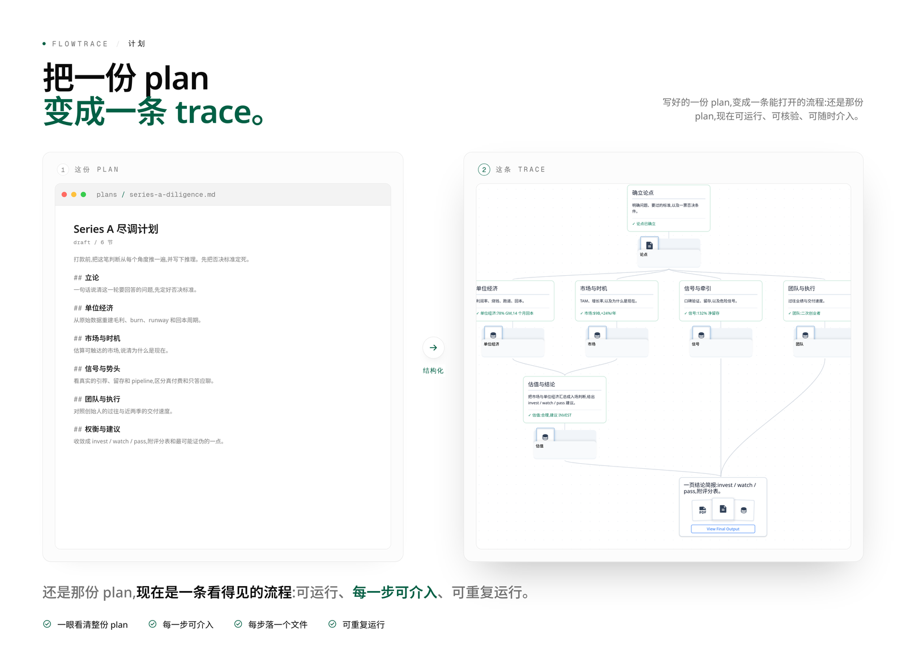</a></td>
<td align="center" valign="top"><a href="assets/zh/onramp/handoff.png">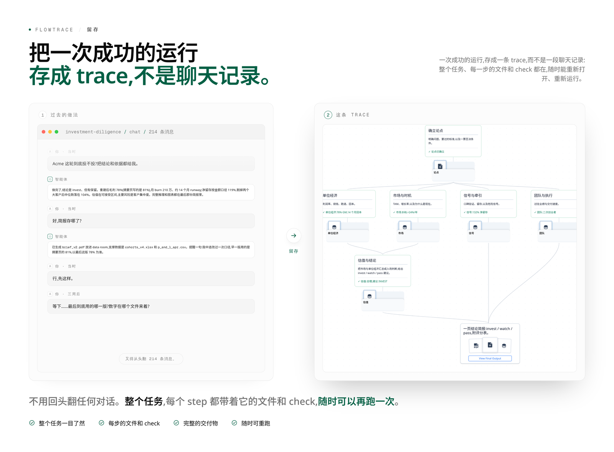</a></td>
</tr>
</table>
</div>

不是每件事都需要这样。随手一次性的小事，聊聊就好。当结果重要到值得核验，或者你会把这件任务再跑一遍时，Flowtrace 才真正派上用场。

## 快速开始

最快的路径是把这个 repo 交给一个 agent。把一个 coding agent（Claude Code、Codex、Cursor）指向这个文件夹，然后说：

> _「安装 Flowtrace，并跑一下 tailored-resume 这个示例。」_

它会装好 CLI，在 `~/traces/tailored-resume/` 下构建一条真实的 trace，并在 `http://localhost:3000` 打开网页视图，流程会在那里一步步亮起来。

拿到一条 trace 的两种方式：

- **试一个参考示例。** 每个示例都附带一个 builder，它会创建一个真实的 trace 文件夹，并完整走一次 run。

  ```bash
  bash scripts/examples/tailored-resume/build.sh   # → ~/traces/tailored-resume/
  flowtrace serve                                  # → http://localhost:3000
  ```

- **做你自己的。** `make-trace` 这个 skill 会把任意来源(一个 `SKILL.md`、一份操作手册、一段 chat 记录、一件做完的任务)变成一条 trace。把 `skills/make-trace/` 复制到 agent 的 skills 目录，然后运行 `/make-trace`。

一次 run 是可以中途介入的：在任意一步停下、改它，依赖它的那些步会重跑，其余的原地不动。

<details>
<summary>手动安装</summary>

```bash
git clone https://github.com/AIScientists-Dev/flowtrace.git
cd flowtrace
./scripts/install.sh        # 构建 + 把 flowtrace 软链到 ~/.local/bin/
```

Windows 上建议从 WSL 运行安装脚本：

```powershell
wsl
```

```bash
cd /mnt/c/tmp
git clone https://github.com/AIScientists-Dev/flowtrace.git
cd flowtrace
./scripts/install.sh
export PATH="$HOME/.local/bin:$PATH"
flowtrace --version
```

如果你要在 Windows 上使用 `make-trace`，包括 PowerShell 与 WSL 路径转换、Cargo/MSVC 常见问题，见 [`skills/make-trace/references/WINDOWS.md`](../skills/make-trace/references/WINDOWS.md)。

用 `git pull && ./scripts/install.sh` 更新。用 `INSTALL_DIR=…` 覆盖软链目标。要从源码构建或参与贡献？见 [CONTRIBUTING.md](../CONTRIBUTING.md)。

</details>

## 示例

**九个示例**，基于流行的开源 skill 构建，覆盖不同领域。在[示例画廊](EXAMPLES.zh-CN.md)里打开任意一个，看它的流程和一行命令的演示：

<div align="center">
<table><tr>
<td align="center" valign="top"><a href="EXAMPLES.zh-CN.md#saas-dd">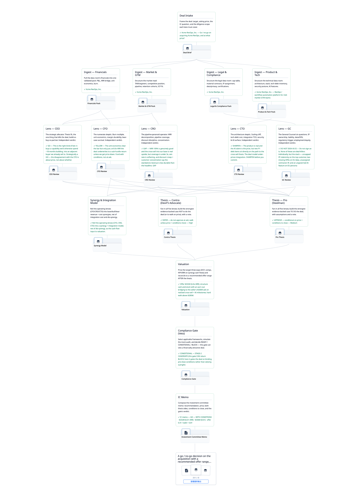</a><br><sub><a href="EXAMPLES.zh-CN.md#saas-dd">SaaS 尽调</a></sub></td>
<td align="center" valign="top"><a href="EXAMPLES.zh-CN.md#security-cicd">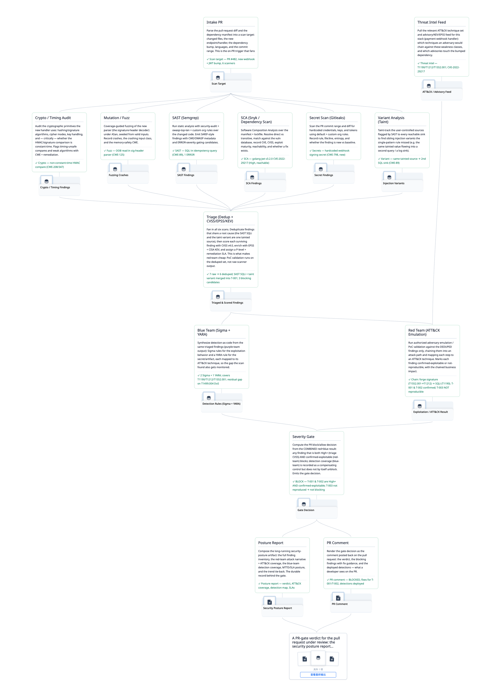</a><br><sub><a href="EXAMPLES.zh-CN.md#security-cicd">安全 CI/CD 闸门</a></sub></td>
<td align="center" valign="top"><a href="EXAMPLES.zh-CN.md#distill-mind">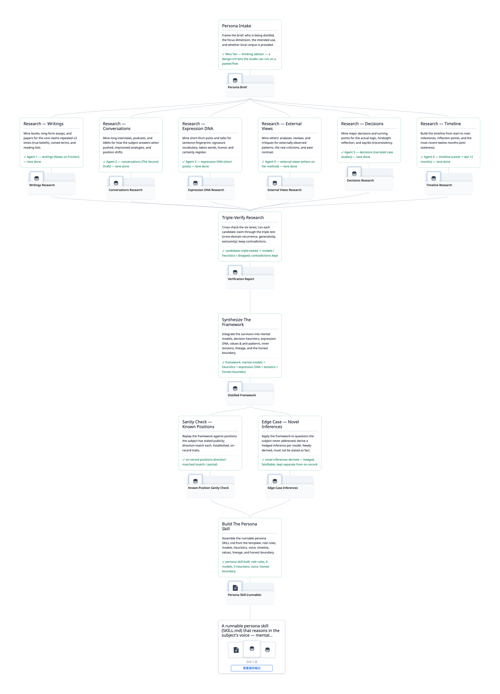</a><br><sub><a href="EXAMPLES.zh-CN.md#distill-mind">把一种思维蒸馏成 skill</a></sub></td>
</tr></table>
</div>

另外还有六个：

- 求职：[定制简历生成器](EXAMPLES.zh-CN.md#tailored-resume)
- 投资：[全面股票分析](EXAMPLES.zh-CN.md#nvda-decision)
- 研究 / 写作：[行业深度报告](EXAMPLES.zh-CN.md#research-writer)
- 软件工程：[Bug 修复学习闭环](EXAMPLES.zh-CN.md#swe-bugfix)
- 增长 / 营销：[每周付费广告优化](EXAMPLES.zh-CN.md#paid-ads)
- 设计 / 演示：[演讲 → 杂志风格幻灯片](EXAMPLES.zh-CN.md#talk-to-deck)

## 文档

一条 trace 就是一个 git 仓库。`trace.json` 声明这些 step、它们的依赖，以及最终交付物。每次 run 落在 `runs/<run_id>/` 下：

```
<trace_root>/
├─ .git/                                    标准 git 仓库，审计轨迹
├─ trace.json                              静态计划(steps + 交付物)
├─ scripts/                                 被 2 步以上共享的代码
├─ resources/                               共享的静态素材(参考、论文、主数据)
├─ steps/<step_id>/
│  ├─ STEP.md                               每一步的契约 + 实现提示
│  ├─ scripts/                              步内代码
│  └─ resources/                            步内素材(图表、PDF、夹具)
└─ runs/<run_id>/
   ├─ state.json                            run 状态(唯一事实来源)
   ├─ replies/NNNN.json                     仅追加的结构化输出流
   └─ <step_id>/                            运行期文件(产物 + 草稿)
```

同一套两名约定(`scripts/` 放会运行的代码，`resources/` 放不运行的静态素材)在 trace 根和每个 step 内部都成立。任何被 2 步以上复用的东西放在 trace 根；单步专用的素材留在该 step 文件夹里。`STEP.md` 用相对路径引用二者。

每次 CLI 写入都会产生一个 git commit，精确限定在它声明的路径上：`state.json` 加上任意 `--asset` 路径，或者新的 reply 文件加上它引用的 evidence 路径。草稿文件保持未跟踪。git 历史就是审计轨迹，UI 可以在它之间时间旅行。

step 之间通过文件传递数据，而不是参数：每一步写出自己的产出，下游的步去读它。

| 想了解 | 阅读 |
|---|---|
| 深入理念 | [PHILOSOPHY.md](trace/PHILOSOPHY.md) |
| 作为 agent 驱动一条 trace | [docs/trace/CLI.md](trace/CLI.md) |
| 做一条 trace | [skills/make-trace/SKILL.md](../skills/make-trace/SKILL.md)，或运行 `/make-trace` |
| 格式规范 | [SCHEMA.md](trace/SCHEMA.md) 和 [FIELDS.md](trace/FIELDS.md) |
| 全部示例 | [EXAMPLES.zh-CN.md](EXAMPLES.zh-CN.md) |

---

## 社区

**如果 Flowtrace 对你有用，欢迎给 repo 点个 star，这能帮到更多人找到它。**

- **参与贡献**：见 [CONTRIBUTING.md](../CONTRIBUTING.md)，也可以看看 [good first issues](https://github.com/AIScientists-Dev/Flowtrace/labels/good%20first%20issue)。
- **GitHub Issues**：[报告 bug / 提出改动](https://github.com/AIScientists-Dev/flowtrace/issues)
- **Discord**：[discord.gg/x9mtbMEx](https://discord.gg/x9mtbMEx)
- **X**：[@morphmind__ai](https://x.com/morphmind__ai?s=11)

---

MIT 许可证。见 [`LICENSE`](../LICENSE)。
